# FitTrack — Документация на проекта

---

## 1. Описание на проекта

**FitTrack** е уеб приложение за проследяване на физическа активност, изградено с **ASP.NET Core 9 MVC**. Приложението позволява на потребителите да разглеждат тренировъчни програми, да се записват в тях, да следят напредъка си и да водят дневник на тренировките.

### Основна функционалност

#### Регистрация и вход
- Потребителят може да се регистрира с имейл и парола.
- При успешна регистрация автоматично получава роля „User" и е пренасочен към настройка на профила.
- Входът поддържа опция „Remember me" и ReturnUrl при пренасочване от защитени страници.

#### Настройка и редактиране на профил
- При първото влизане потребителят преминава задължително през страница за попълване на профил (ProfileSetupMiddleware).
- Събирани данни: ръст (см), тегло (кг), възраст, пол, фитнес цел и фитнес ниво.
- BMI се изчислява автоматично и се показва с цветно обозначение (Underweight / Normal / Overweight / Obese).
- Профилът може да се редактира по всяко време.

#### Тренировъчни програми
- Списък с всички програми с възможност за филтриране по **ниво** (Beginner / Intermediate / Advanced) и **категория** (Strength / Cardio / Flexibility).
- Всяка програма има детайлна страница с описание, упражнения и седмичен план.
- Програмите могат да бъдат маркирани като **„Workout Only"** — показват само упражнения, без седмичен план.
- Потребителят може да се запише или отпише от програма.
- Показва се брой записани потребители и средна оценка.

#### Седмичен план
- Всяка програма може да има структуриран план по седмици и дни.
- Всеки ден от плана съдържа фокус, бележки и списък с упражнения (с брой серии, повторения и мерна единица).

#### Календар
- При записване в програма, тренировките автоматично се добавят в календара на потребителя.
- Календарът показва месечен изглед с маркирани тренировъчни дни.
- Потребителят може да отбелязва тренировки като изпълнени и да добавя бележки.
- При кликване върху ден се показват детайли за тренировката (упражнения, серии, повторения).

#### Проследяване на напредъка
- **Дневник на теглото**: записване на тегло с дата и бележки; история с опция за изтриване.
- **Дневник на тренировките**: логване на изпълнена тренировка с продължителност (минути), самочувствие и бележки.
- **Табло за напредък**: показва начално/текущо тегло, общо тренировки, текуща серия (streak), активни програми и графики.
- Графики на теглото са визуализирани с **Chart.js** (последните 30 записа).

#### Отзиви (Reviews)
- Записан потребител може да остави оценка (1—5 звезди) и коментар за програма.
- Всеки потребител може да пише само един отзив за дадена програма.
- Отзивът може да бъде изтрит от автора или от администратор.

#### Администраторски панел
- Достъпен само за потребители с роля **Admin**.
- **Програми**: създаване, редактиране, изтриване (включително каскадно изтриване на свързаните данни).
- **Упражнения**: добавяне, редактиране и изтриване на упражнения към програма.
- **Седмичен план**: пълно управление на седмици, дни и упражнения за всеки ден.
- **Потребители**: списък с всички регистрирани потребители и техните роли.
- **Отзиви**: преглед и изтриване на всички отзиви в системата.

---

## 2. Ръководство на потребителя

### 2.1 Регистрация

Отворете приложението и натиснете **„Get Started"** в горния десен ъгъл.

[Снимка: Начална страница с бутон „Get Started"]

Попълнете имейл адрес и парола (минимум 6 символа, поне една главна буква и цифра). Натиснете **„Register"**.

[Снимка: Форма за регистрация]

---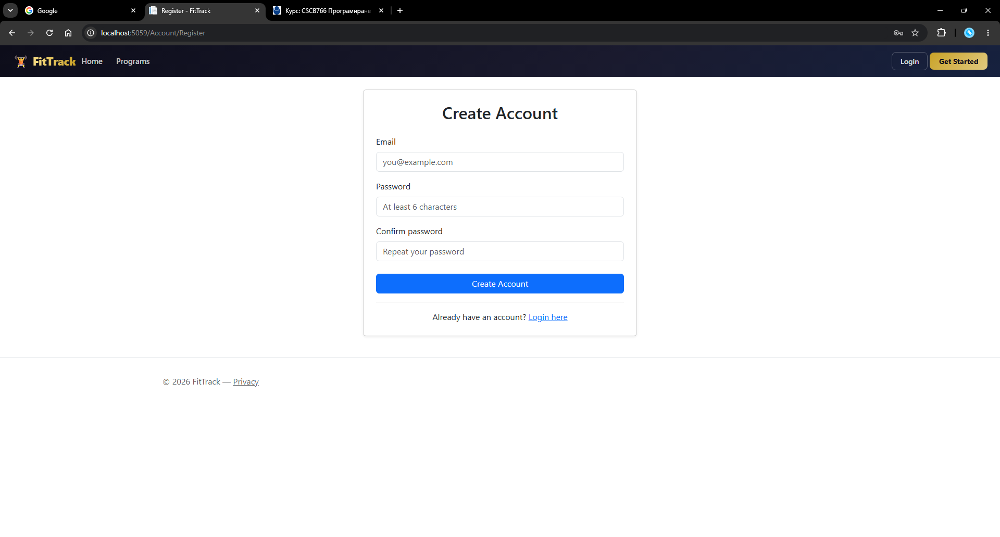

### 2.2 Настройка на профила (първо влизане)

След регистрация системата автоматично ви пренасочва към страница за попълване на здравни данни.

Попълнете: ръст, тегло, възраст, пол, фитнес цел и фитнес ниво. Натиснете **„Save Profile"**.

[Снимка: Страница за настройка на профил]

---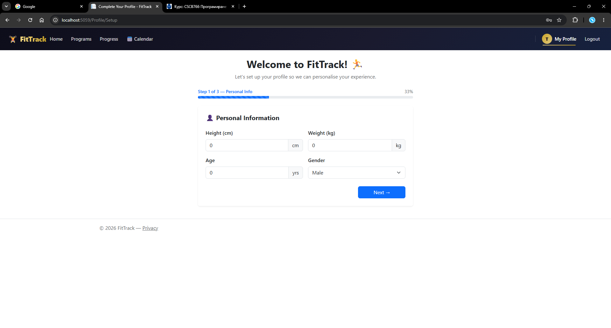

### 2.3 Начална страница

На началната страница виждате:
- Три препоръчани програми (с най-висока средна оценка).
- Статистики: общ брой програми, упражнения, членове и записани тренировки.

[Снимка: Начална страница след вход]

--- 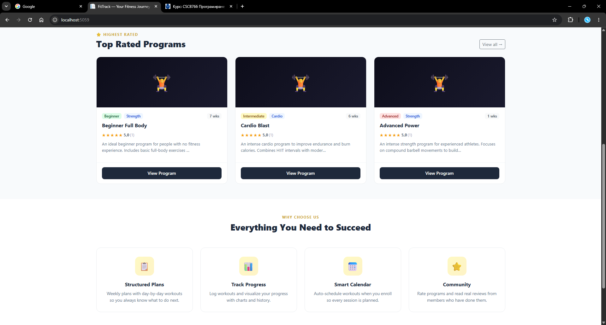

### 2.4 Разглеждане на програми

Натиснете **„Programs"** в навигацията.

Можете да филтрирате по ниво (Beginner / Intermediate / Advanced) и категория (Strength / Cardio / Flexibility).

[Снимка: Списък с програми и филтри]

Натиснете **„View Details"** на желана програма.

---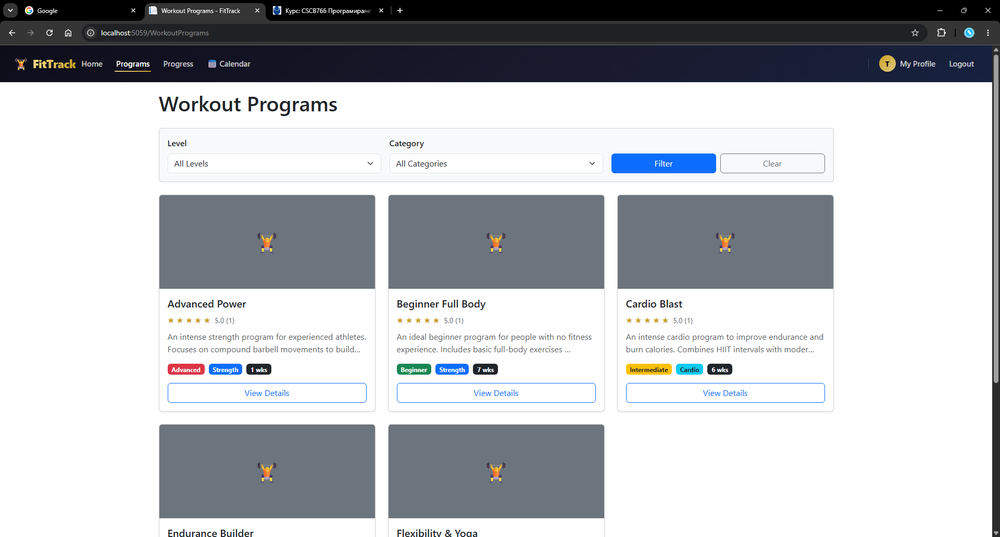

### 2.5 Записване в програма

На страницата с детайли на програмата натиснете бутона **„Enroll"**.

[Снимка: Страница с детайли на програма и бутон Enroll]

При успешно записване системата автоматично генерира тренировки в Календара ви.

---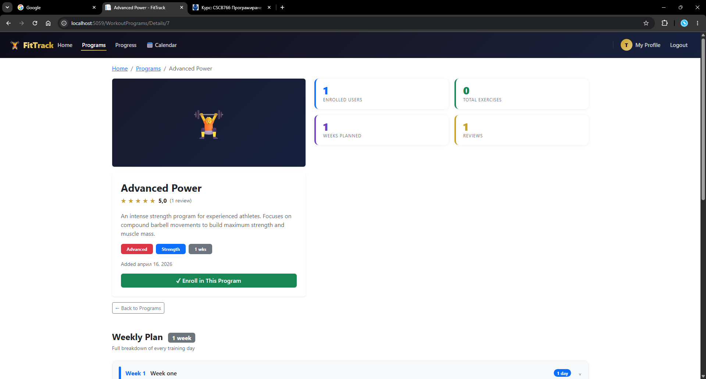

### 2.6 Календар

Отворете **„Calendar"** от навигацията.

Виждате месечен изглед с маркирани тренировъчни дни.

[Снимка: Месечен изглед на календара]

Натиснете върху тренировъчен ден — появява се панел с детайли.

[Снимка: Панел с детайли за деня (упражнения, серии, повторения)]

Поставете отметка **„Mark as Completed"**, за да отбележите тренировката.

---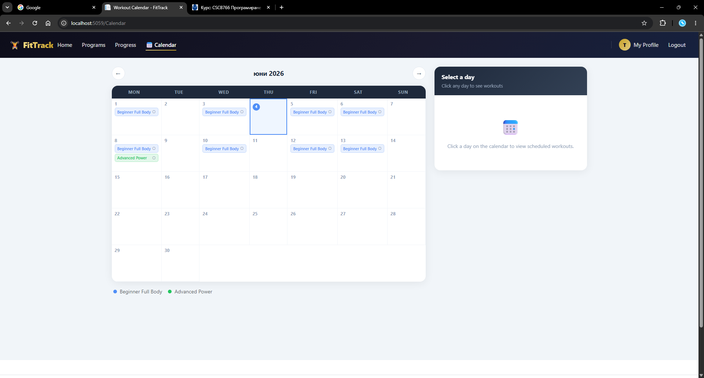

### 2.7 Проследяване на напредъка

Отворете **„Progress"** от навигацията. Виждате таблото с обобщена информация.

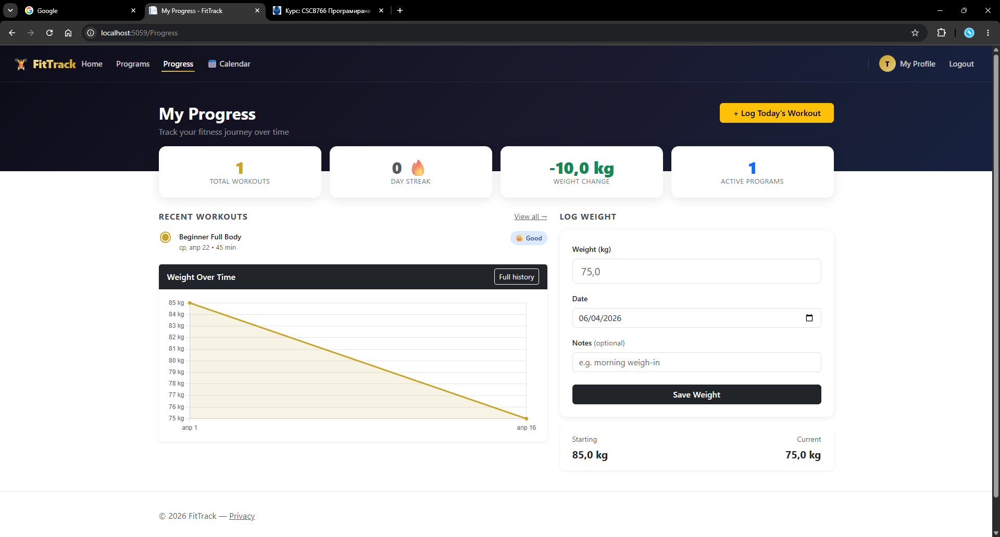

#### Записване на тегло
Натиснете **„Log Weight"**, въведете тегло и дата, натиснете **„Save"**.

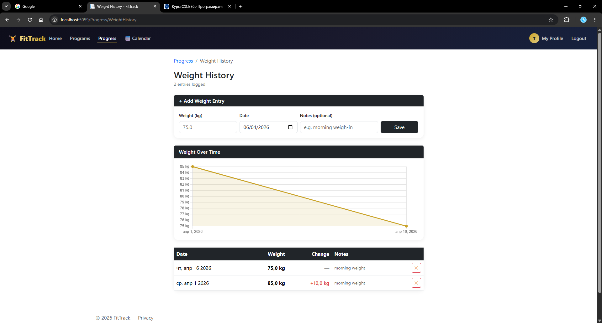

#### Логване на тренировка
Натиснете **„Log Workout"**, изберете програма, продължителност и самочувствие.

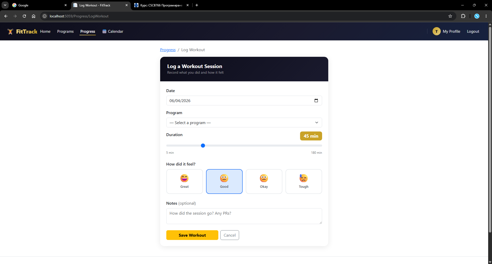
---

### 2.8 Оставяне на отзив

На страницата с детайли на програмата (след записване) се показва секция за отзив.

Изберете оценка от 1 до 5 звезди и напишете коментар. Натиснете **„Submit Review"**.

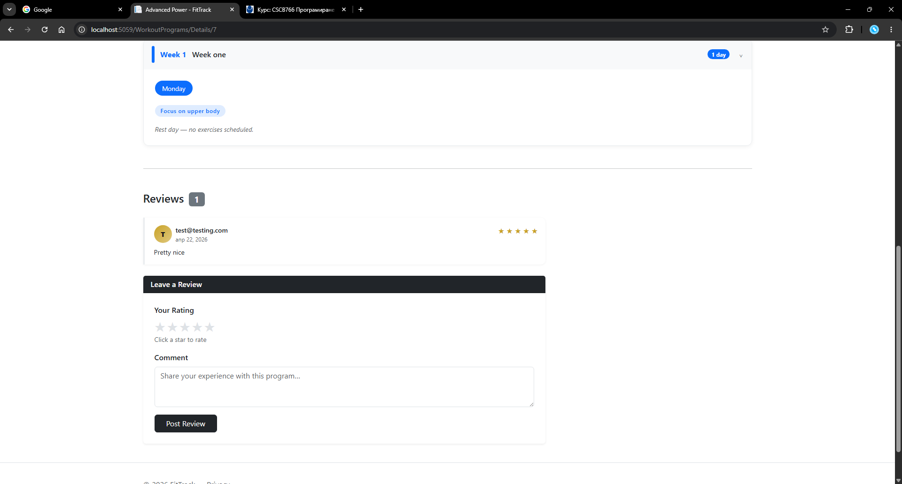

---

### 2.9 Редактиране на профила

Отворете **„My Profile"**. В долния десен ъгъл на страницата има плаващ златен бутон с икона на молив (**✎**). Натиснете го.

Обновете желаните полета и натиснете **„Save Changes"**.

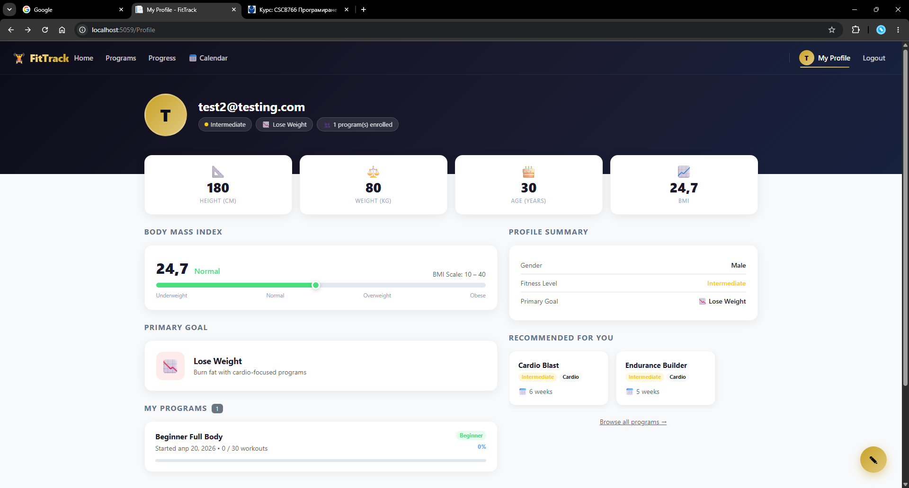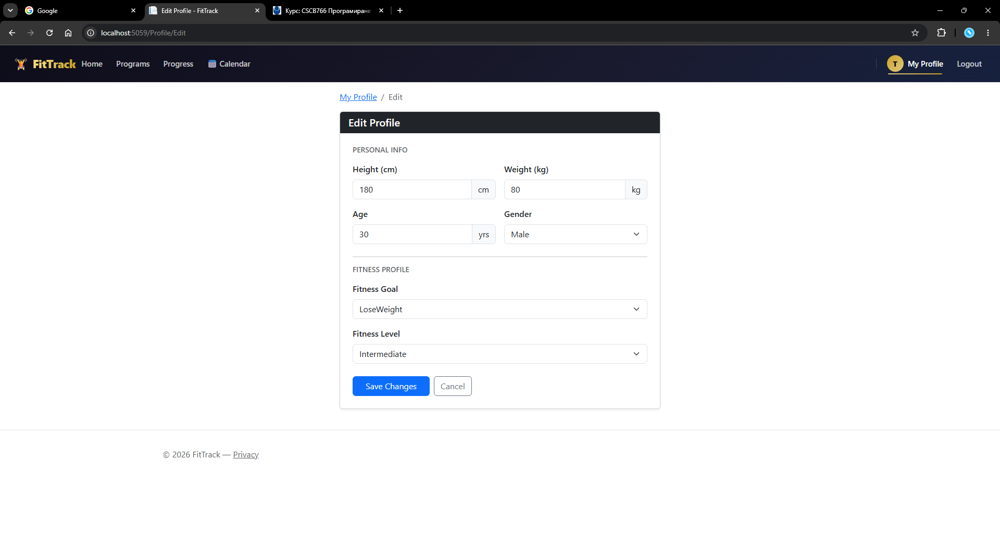

---

### 2.10 Администраторски панел

Влезте с акаунт с роля Admin. В навигацията се появява меню **„⚙ Admin"**.

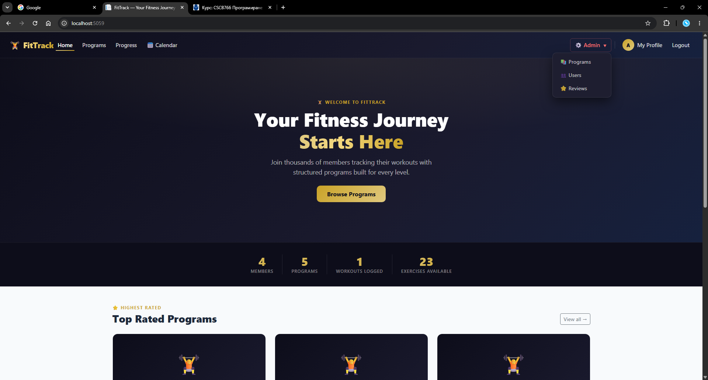

#### Създаване на програма
Admin → Programs → **„New Program"** → попълнете полетата → **„Create Program"**.

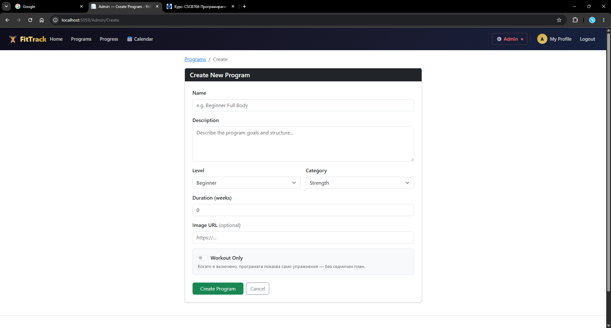

#### Управление на упражнения
Натиснете **„Manage Exercises"** до желана програма. Добавете упражнение с форма (Име, Описание, Мускулна група, Серии, Повторения).

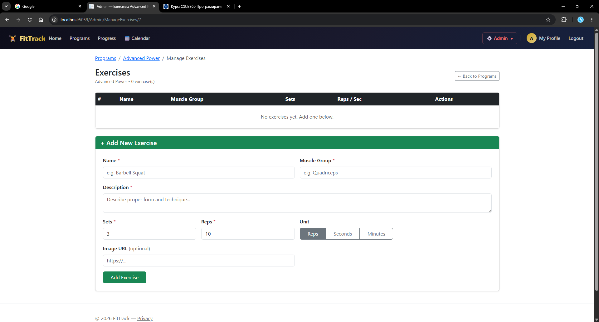

#### Управление на седмичен план
От Admin панела натиснете **„Weekly Plan"** до програма. Добавете седмица и дни с упражнения.

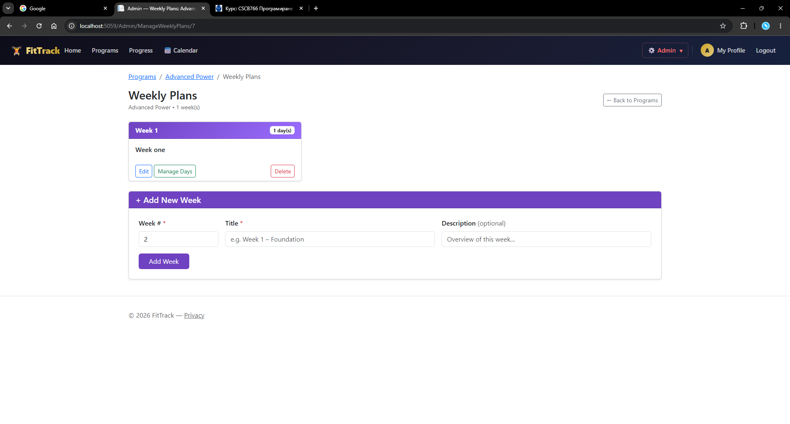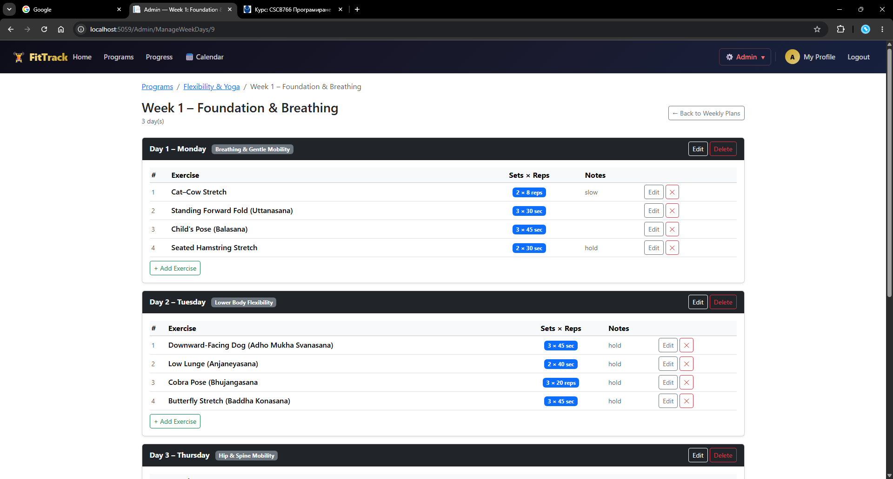

---

## 3. Описание на базата данни

Базата данни е **SQL Server** (локален SQLEXPRESS), управлявана с **Entity Framework Core 9** (Code First с миграции).

### Таблици

| Таблица | Описание |
|---|---|
| `AspNetUsers` | Потребители (наследява Identity — имейл, парола, роли). Допълнителни полета: Height, Weight, Age, Gender, FitnessGoal, FitnessLevel, HasCompletedProfile. |
| `AspNetRoles` | Роли — „Admin" и „User". |
| `AspNetUserRoles` | Връзка потребител — роля (много-към-много). |
| `WorkoutPrograms` | Тренировъчни програми: Name, Description, Level, Category, DurationWeeks, ImageUrl, IsWorkoutOnly, CreatedOn. |
| `Exercises` | Упражнения: Name, Description, MuscleGroup, Sets, Reps, RepUnit (Reps/Seconds/Minutes), ImageUrl. |
| `ProgramExercises` | Свързваща таблица WorkoutProgram ↔ Exercise (много-към-много). |
| `UserPrograms` | Записване на потребител в програма: UserId, WorkoutProgramId, StartDate, IsCompleted, CompletedWorkouts. |
| `WeightLogs` | Записи на тегло: UserId, Weight, LoggedOn, Notes. |
| `WorkoutLogs` | Записи на тренировки: UserId, WorkoutProgramId, LoggedOn, DurationMinutes, Feeling, Notes. |
| `ProgramReviews` | Отзиви: UserId, WorkoutProgramId, Rating (1—5), Comment, CreatedOn. Уникален индекс по (UserId, WorkoutProgramId). |
| `WeeklyPlans` | Седмичен план към програма: WorkoutProgramId, WeekNumber, Title, Description. |
| `WeeklyPlanDays` | Ден от седмичния план: WeeklyPlanId, DayNumber, DayName, Focus, Notes. |
| `WeeklyPlanDayExercises` | Упражнение за конкретен ден: WeeklyPlanDayId, ExerciseName, Sets, Reps, RepUnit, OrderIndex, Notes. |
| `CalendarEntries` | Календарни записи (автогенерирани при записване): UserId, WorkoutProgramId, WeeklyPlanDayId, ScheduledDate, IsCompleted, CompletedOn, Notes. |

### Основни релации

```
ApplicationUser  ──<  UserPrograms  >──  WorkoutProgram
ApplicationUser  ──<  WeightLogs
ApplicationUser  ──<  WorkoutLogs    >──  WorkoutProgram
ApplicationUser  ──<  ProgramReviews >──  WorkoutProgram
ApplicationUser  ──<  CalendarEntries >── WorkoutProgram
                                          WeeklyPlanDay

WorkoutProgram   ──<  ProgramExercises >──  Exercise
WorkoutProgram   ──<  WeeklyPlans
WeeklyPlan       ──<  WeeklyPlanDays
WeeklyPlanDay    ──<  WeeklyPlanDayExercises
```

### Правила за изтриване (Delete Behavior)

| Релация | Поведение |
|---|---|
| Потребител → UserPrograms, WeightLogs, WorkoutLogs, Reviews, CalendarEntries | Cascade (изтриват се с потребителя) |
| WorkoutProgram → ProgramExercises, UserPrograms, Reviews, WeeklyPlans, CalendarEntries | Cascade |
| WorkoutProgram → WorkoutLogs | **Restrict** — WorkoutLogs трябва да се изтрият ръчно преди програмата |
| WeeklyPlan → WeeklyPlanDays → WeeklyPlanDayExercises | Cascade |

---

## 4. Описание на външни компоненти

### NuGet пакети

| Пакет | Версия | Предназначение |
|---|---|---|
| `Microsoft.AspNetCore.Identity.EntityFrameworkCore` | 9.0 | Интеграция на ASP.NET Core Identity с Entity Framework Core — съхранение на потребители, роли и Claims в SQL база данни. |
| `Microsoft.AspNetCore.Identity.UI` | 9.0 | Scaffolded Razor Pages за Identity (използван частично за `_ValidationScriptsPartial`). |
| `Microsoft.EntityFrameworkCore.SqlServer` | 9.0 | EF Core provider за SQL Server — позволява работа с Microsoft SQL Server / SQLEXPRESS. |
| `Microsoft.EntityFrameworkCore.Tools` | 9.0 | Инструменти за CLI — позволява изпълнение на `dotnet ef migrations add` и `dotnet ef database update`. |

### Frontend библиотеки (wwwroot/lib)

| Библиотека | Предназначение |
|---|---|
| **Bootstrap 5** | CSS framework за оформление на потребителския интерфейс — grid система, форми, навигация, карти, модали, form-switch компоненти. |
| **jQuery** | JavaScript библиотека, използвана от Bootstrap и от валидационните скриптове на ASP.NET. |
| **Chart.js** | JavaScript библиотека за визуализация на данни — използва се в страниците за напредък (Progress) за изчертаване на графика на теглото. |

### Вградени в .NET инфраструктурни компоненти

| Компонент | Описание |
|---|---|
| **ASP.NET Core Identity** | Цялостна система за управление на потребители — регистрация, вход, роли, криптиране на пароли с PasswordHasher. Конфигурирана с `AddIdentity<ApplicationUser, IdentityRole>`. |
| **Entity Framework Core (Code First)** | ORM за работа с базата данни чрез C# модели. Миграциите се прилагат автоматично при стартиране чрез `db.Database.MigrateAsync()` в `DbSeeder`. |
| **Razor Views (.cshtml)** | Шаблонен двигател, интегриран в MVC — комбинира HTML с C# изрази за генериране на динамично съдържание. |
| **Tag Helpers** | ASP.NET Core механизъм за генериране на HTML атрибути (`asp-for`, `asp-action`, `asp-validation-for`) — свързва формите директно с моделите. |
| **TempData** | Механизъм за пренасяне на flash съобщения между redirect-и (напр. `TempData["Success"]`, `TempData["Error"]`). |
| **Middleware (ProfileSetupMiddleware)** | Персонализиран middleware, написан ръчно — проверява дали влезлият потребител е попълнил профила си и при нужда го пренасочва към `/Profile/Setup`. |

---

## 5. Как се стартира проектът

### Изисквания

| Изискване | Версия |
|---|---|
| .NET SDK | 9.0 или по-нова |
| SQL Server | Express / Developer / Standard |
| SSMS (SQL Server Management Studio) | По избор, за импорт на базата |

### Стъпки

**1. Клонирай проекта от GitHub**

```
git clone https://github.com/ЛИНК_КЪМ_РЕПОТО
```

или свали като ZIP от GitHub → **Code → Download ZIP** и разархивирай.

---

**2. Импортирай базата данни**

Отвори **SSMS** → свържи се към сървъра → **File → Open → File...** → избери приложения `.sql` файл → натисни **Execute (F5)**.

Базата `FitTrackDb` се създава автоматично с всички таблици и данни.

---

**3. Провери connection string (при нужда)**

Отвори `FitTrack/appsettings.json`. По подразбиране е:

```json
"DefaultConnection": "Server=localhost\\SQLEXPRESS;Database=FitTrackDb;Trusted_Connection=True;TrustServerCertificate=True;"
```

Ако SQL Server инстанцията е различна (напр. `MSSQLSERVER`), смени `localhost\\SQLEXPRESS` с правилното име.

---

**4. Стартирай приложението**

```
cd FitTrack
dotnet run
```

или отвори `.sln` файла във **Visual Studio** и натисни **F5**.

---

**5. Отвори в браузър**

След стартиране адресът се показва в терминала (обикновено `https://localhost:5001` или `http://localhost:5000`).

---

### Данни за вход

| Роля | Имейл | Парола |
|---|---|---|
| **Admin** | `admin@fittrack.com` | `Admin123!` |
| **Потребител** | Регистрирай се от формата | — |
